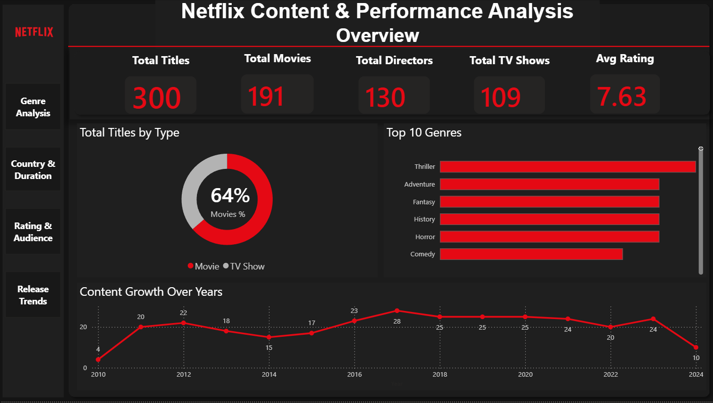
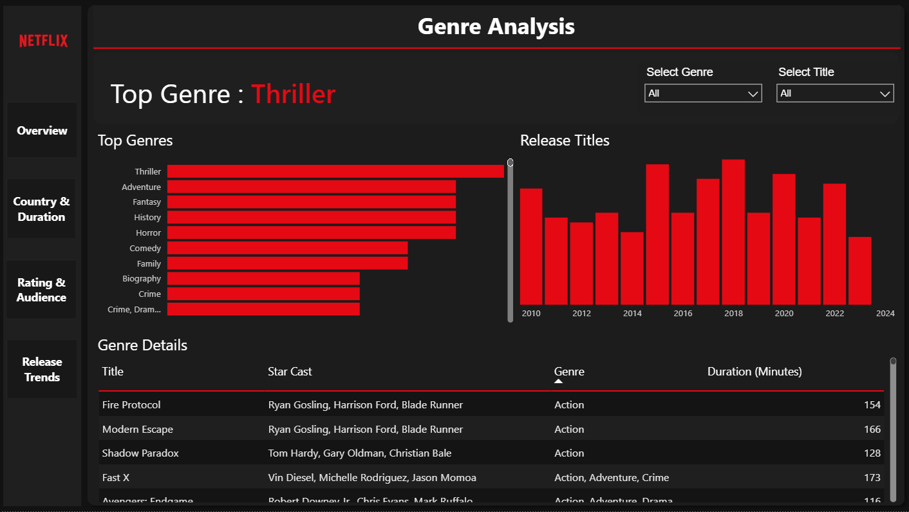

# 🎬 Netflix Content & Performance Analysis Dashboard

## 📊 Project Overview

This project is an interactive Power BI dashboard developed to analyze Netflix's content library and identify trends in content distribution, genres, ratings, countries, and release patterns.

The dashboard transforms raw Netflix data into meaningful visual insights using data cleaning, data modeling, and interactive visualizations.

## 🎯 Project Objectives

- Analyze the distribution of Movies and TV Shows
- Identify the most common content ratings
- Analyze content trends over the years
- Explore popular genres and categories
- Analyze country-wise content production
- Understand Netflix's content growth and distribution patterns

## 🛠️ Tools & Technologies

- Microsoft Power BI
- Power Query
- DAX
- Data Modeling
- Data Visualization

## 📈 Key Dashboard Features

- Total Movies and TV Shows analysis
- Content type distribution
- Genre and category analysis
- Country-wise content analysis
- Release year trends
- Rating distribution
- Interactive filters and slicers

## 💡 Key Insights

- Analyzed Netflix's content catalog to understand the distribution between Movies and TV Shows.
- Identified trends in content production and release over the years.
- Examined the most common genres and content ratings.
- Analyzed the geographic distribution of Netflix content.

## 📁 Project File

The Power BI project file is included in this repository:

`Netflix Analysis Project.pbix`

## 👨‍💻 Author

**Nithish**

Aspiring Data Analyst | Power BI | SQL | Python | Excel

## 📸 Dashboard Screenshots

### 📊 Overview

### 🎭 Genre Analysis

### 🌍 Country & Duration Analysis

### ⭐ Ratings & Audience Analysis

### 📅 Release Trends Analysis

